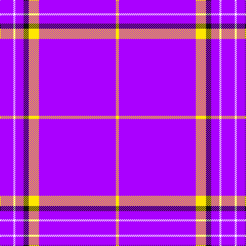

The parent of this is [East Carolina University](/tartans/p/26/w4/p16/k10/y20/p150/y/6/)

This was sourced from register-of-tartans.  It is a [7 stripes tartan](/stripes/stripes7/).

Original link https://www.tartanregister.gov.uk/tartanDetails.aspx?ref=10516

## Thread count
P/26 W4 P16 K10 Y20 P150 Y/6

## Palette
Each colour and its ΔE from the base-6 reference it is a variant of.

| Colour | Shade | Base | ΔE (OKLab) |
|---|---|---|---|
| K |  `#101010` | K  | 0.17 |
| P |  `#AA00FF` | B  | 0.29 |
| W |  `#FFFFFF` | W  | 0.03 |
| Y |  `#FFE700` | Y  | 0.11 |

# Sample pattern

ID: /variants/p/26/w4/p16/k10/y20/p150/y/6-k101010-paa00ff-wffffff-yffe700/
