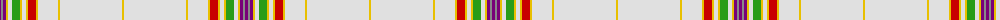

The parent of this is [Druid (Corporate)](/tartans/p/3/n2/p3/y2/ln4/g8/y2/ln4/y2/r8/y2/ln20/y2/ln62/y/2/)

This was sourced from tartans-authority.  It is a [15 stripes tartan](/stripes/stripes15/).

Original link http://www.tartansauthority.com/tartan-ferret/display/10102/

## Thread count
P/3 N2 P3 Y2 LN4 G8 Y2 LN4 Y2 R8 Y2 LN20 Y2 LN62 Y/2

## Palette
Each colour and its ΔE from the base-6 reference it is a variant of.

| Colour | Shade | Base | ΔE (OKLab) |
|---|---|---|---|
| G |  `#289C18` | G  | 0.18 |
| LN |  `#E0E0E0` | W  | 0.06 |
| N |  `#888888` | R  | 0.24 |
| P |  `#780078` | B  | 0.16 |
| R |  `#C80000` | R  | 0.00 |
| Y |  `#E8C000` | Y  | 0.00 |

ID: /variants/p/3/n2/p3/y2/ln4/g8/y2/ln4/y2/r8/y2/ln20/y2/ln62/y/2-g289c18-lne0e0e0-n888888-p780078-rc80000-ye8c000/
