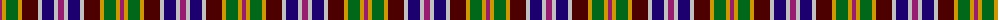

The parent of this is [Bhutan](/tartans/p/4/dy4/g12/dy4/dr16/n4/db12/n4/p/6/)

This was sourced from register-of-tartans.  It is a [9 stripes tartan](/stripes/stripes9/).

Original link https://www.tartanregister.gov.uk/tartanDetails.aspx?ref=5044

## Thread count
P/4 DY4 G12 DY4 DR16 N4 DB12 N4 P/6

## Palette
Each colour and its ΔE from the base-6 reference it is a variant of.

| Colour | Shade | Base | ΔE (OKLab) |
|---|---|---|---|
| DB |  `#1C0070` | B  | 0.14 |
| DR |  `#4C0000` | B  | 0.24 |
| DY |  `#D09800` | Y  | 0.11 |
| G |  `#006818` | G  | 0.02 |
| N |  `#C0C0C0` | W  | 0.16 |
| P |  `#981C70` | R  | 0.16 |

ID: /variants/p/4/dy4/g12/dy4/dr16/n4/db12/n4/p/6-db1c0070-dr4c0000-dyd09800-g006818-nc0c0c0-p981c70/
