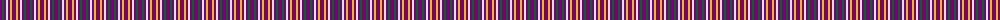
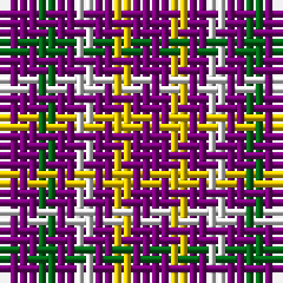

The parent of this is [Justus International Tartan Tartan Number: 109. Earliest known date: pre 2003 Y = Saffron. Seen at Grandfather Mountain Games by Bob Martin in 1981 or 1982 See products available Copyright © Blair Urquhart, Comrie, 2015](/tartans/p/4/g2/p2/ln2/p2/y2/p/4/)

This was sourced from house-of-tartan.  It is a [7 stripes tartan](/stripes/stripes7/).

Original link http://www.house-of-tartan.scotland.net/house/TartanViewjs.asp?colr=Def&tnam=109

## Thread count
P/4 G2 P2 LN2 P2 Y2 P/4

## Palette
Each colour and its ΔE from the base-6 reference it is a variant of.

| Colour | Shade | Base | ΔE (OKLab) |
|---|---|---|---|
| G |  `#006818` | G  | 0.02 |
| LN |  `#E0E0E0` | W  | 0.06 |
| P |  `#780078` | B  | 0.16 |
| Y |  `#E8C000` | Y  | 0.00 |

# Sample pattern

ID: /variants/p/4/g2/p2/ln2/p2/y2/p/4-g006818-lne0e0e0-p780078-ye8c000/
