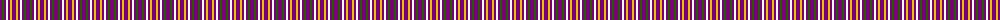
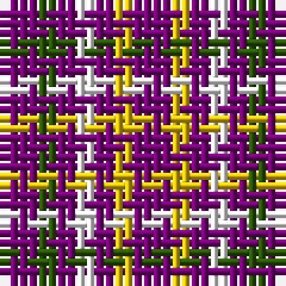

The parent of this is [Justus International (Personal)](/tartans/p/4/g2/p2/w2/p2/y2/p/4/)

This was sourced from tartans-authority.  It is a [7 stripes tartan](/stripes/stripes7/).

Original link http://www.tartansauthority.com/tartan-ferret/display/109/

## Thread count
P/4 G2 P2 W2 P2 Y2 P/4

## Palette
Each colour and its ΔE from the base-6 reference it is a variant of.

| Colour | Shade | Base | ΔE (OKLab) |
|---|---|---|---|
| G |  `#285800` | G  | 0.04 |
| P |  `#780078` | B  | 0.16 |
| W |  `#FCFCFC` | W  | 0.03 |
| Y |  `#E8C000` | Y  | 0.00 |

# Sample pattern

ID: /variants/p/4/g2/p2/w2/p2/y2/p/4-g285800-p780078-wfcfcfc-ye8c000/
