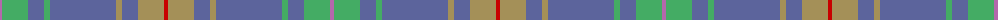

The parent of this is [Burt #1 (Name)](/tartans/p/4/g26/b16/g6/b66/lt6/b16/lt26/r/4/)

This was sourced from tartans-authority.  It is a [9 stripes tartan](/stripes/stripes9/).

Original link http://www.tartansauthority.com/tartan-ferret/display/6148/

## Thread count
P/4 G26 B16 G6 B66 LT6 B16 LT26 R/4

## Palette
Each colour and its ΔE from the base-6 reference it is a variant of.

| Colour | Shade | Base | ΔE (OKLab) |
|---|---|---|---|
| B |  `#5C649C` | B  | 0.13 |
| G |  `#44AC64` | Y  | 0.21 |
| LT |  `#A49058` | Y  | 0.18 |
| P |  `#B468AC` | R  | 0.21 |
| R |  `#C80000` | R  | 0.00 |

ID: /variants/p/4/g26/b16/g6/b66/lt6/b16/lt26/r/4-b5c649c-g44ac64-lta49058-pb468ac-rc80000/
