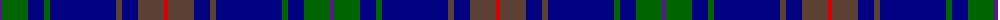

The parent of this is [Burt Family](/tartans/p/4/g26/db16/g6/db66/t6/db16/t26/r/4/)

This was sourced from register-of-tartans.  It is a [9 stripes tartan](/stripes/stripes9/).

Original link https://www.tartanregister.gov.uk/tartanDetails.aspx?ref=4923

## Thread count
P/4 G26 DB16 G6 DB66 T6 DB16 T26 R/4

## Palette
Each colour and its ΔE from the base-6 reference it is a variant of.

| Colour | Shade | Base | ΔE (OKLab) |
|---|---|---|---|
| DB |  `#000080` | B  | 0.14 |
| G |  `#006400` | G  | 0.00 |
| P |  `#551A8B` | B  | 0.10 |
| R |  `#DC0000` | R  | 0.04 |
| T |  `#5C4033` | B  | 0.15 |

ID: /variants/p/4/g26/db16/g6/db66/t6/db16/t26/r/4-db000080-g006400-p551a8b-rdc0000-t5c4033/
