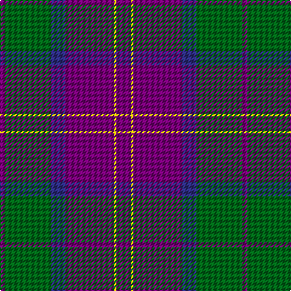

The parent of this is [Discover Islay (District)](/tartans/p/4/g38/db12/p40/y2/p/12/)

This was sourced from tartans-authority.  It is a [6 stripes tartan](/stripes/stripes6/).

Original link http://www.tartansauthority.com/tartan-ferret/display/7683/

## Thread count
P/4 G38 DB12 P40 Y2 P/12

## Palette
Each colour and its ΔE from the base-6 reference it is a variant of.

| Colour | Shade | Base | ΔE (OKLab) |
|---|---|---|---|
| DB |  `#2C2C80` | B  | 0.05 |
| G |  `#006818` | G  | 0.02 |
| P |  `#780078` | B  | 0.16 |
| Y |  `#E8C000` | Y  | 0.00 |

# Sample pattern

ID: /variants/p/4/g38/db12/p40/y2/p/12-db2c2c80-g006818-p780078-ye8c000/
