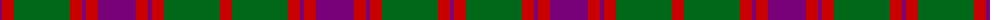

The parent of this is [Wilson's No.119](/tartans/p/4/r12/g56/r12/p4/r12/p38/r12/p4/r12/g56/r/12/)

This was sourced from register-of-tartans.  It is a [12 stripes tartan](/stripes/stripes12/).

Original link https://www.tartanregister.gov.uk/tartanDetails.aspx?ref=4685

## Thread count
P/4 R12 G56 R12 P4 R12 P38 R12 P4 R12 G56 R/12

## Palette
Each colour and its ΔE from the base-6 reference it is a variant of.

| Colour | Shade | Base | ΔE (OKLab) |
|---|---|---|---|
| DG |  `#003820` | G  | 0.16 |
| DP |  `#440044` | B  | 0.17 |
| G |  `#006818` | G  | 0.02 |
| P |  `#780078` | B  | 0.16 |
| R |  `#C80000` | R  | 0.00 |

ID: /variants/p/4/r12/g56/r12/p4/r12/p38/r12/p4/r12/g56/r/12-dg003820-dp440044-g006818-p780078-rc80000/
