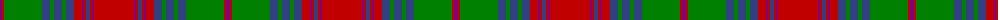

The parent of this is [Ladybird](/tartans/p/4/r2/g38/b8/g4/b8/g4/b8/r8/p2/r2/b4/r2/p2/r/40/)

This was sourced from weddslist.  It is a [15 stripes tartan](/stripes/stripes15/).

Original link http://www.weddslist.com/cgi-bin/tartans/pg.pl?source=sts

## Thread count
P/4 R2 G38 B8 G4 B8 G4 B8 R8 P2 R2 B4 R2 P2 R/40

## Palette
Each colour and its ΔE from the base-6 reference it is a variant of.

| Colour | Shade | Base | ΔE (OKLab) |
|---|---|---|---|
| B |  `#304080` | B  | 0.01 |
| G |  `#008000` | G  | 0.09 |
| P |  `#800080` | B  | 0.17 |
| R |  `#C00000` | R  | 0.02 |

ID: /variants/p/4/r2/g38/b8/g4/b8/g4/b8/r8/p2/r2/b4/r2/p2/r/40-b304080-g008000-p800080-rc00000/
