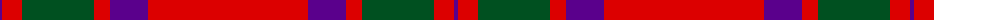
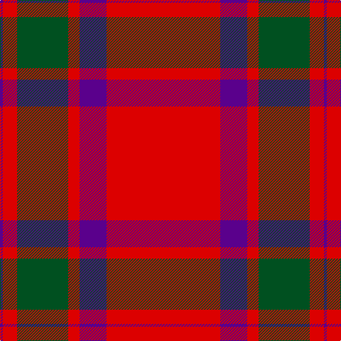

The parent of this is [Lovat or Fraser #2](/tartans/p/4/r20/g72/r16/p38/r/160/)

This was sourced from register-of-tartans.  It is a [6 stripes tartan](/stripes/stripes6/).

Original link https://www.tartanregister.gov.uk/tartanDetails.aspx?ref=2236

## Thread count
P/4 R20 G72 R16 P38 R/160

## Palette
Each colour and its ΔE from the base-6 reference it is a variant of.

| Colour | Shade | Base | ΔE (OKLab) |
|---|---|---|---|
| G |  `#005020` | G  | 0.08 |
| P |  `#5A008C` | B  | 0.12 |
| R |  `#DC0000` | R  | 0.04 |

# Sample pattern

ID: /variants/p/4/r20/g72/r16/p38/r/160-g005020-p5a008c-rdc0000/
