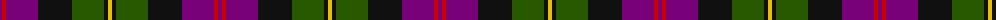

The parent of this is [Zangenberg (Personal)](/tartans/p/4/r4/p32/k34/g32/k4/y/4/)

This was sourced from tartans-authority.  It is a [7 stripes tartan](/stripes/stripes7/).

Original link http://www.tartansauthority.com/tartan-ferret/display/4045/

## Thread count
P/4 R4 P32 K34 G32 K4 Y/4

## Palette
Each colour and its ΔE from the base-6 reference it is a variant of.

| Colour | Shade | Base | ΔE (OKLab) |
|---|---|---|---|
| G |  `#285800` | G  | 0.04 |
| K |  `#101010` | K  | 0.17 |
| P |  `#780078` | B  | 0.16 |
| R |  `#C80000` | R  | 0.00 |
| Y |  `#E8C000` | Y  | 0.00 |

# Sample pattern

ID: /variants/p/4/r4/p32/k34/g32/k4/y/4-g285800-k101010-p780078-rc80000-ye8c000/
