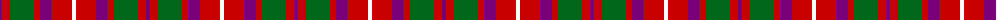

The parent of this is [MacKintosh-Geddes (Personal?)](/tartans/p/4/r8/g24/r6/p12/r20/w/4/)

This was sourced from tartans-authority.  It is a [7 stripes tartan](/stripes/stripes7/).

Original link http://www.tartansauthority.com/tartan-ferret/display/543/

## Thread count
P/4 R8 G24 R6 P12 R20 W/4

## Palette
Each colour and its ΔE from the base-6 reference it is a variant of.

| Colour | Shade | Base | ΔE (OKLab) |
|---|---|---|---|
| G |  `#006818` | G  | 0.02 |
| P |  `#780078` | B  | 0.16 |
| R |  `#C80000` | R  | 0.00 |
| W |  `#FCFCFC` | W  | 0.03 |

# Sample pattern

ID: /variants/p/4/r8/g24/r6/p12/r20/w/4-g006818-p780078-rc80000-wfcfcfc/
