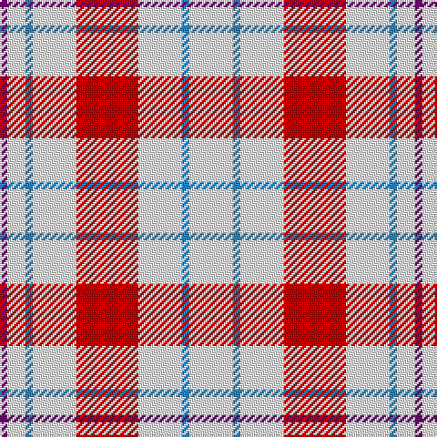

The parent of this is [Milne, Dress (Dance)](/tartans/p/4/w10/b4/w24/r34/w24/b4/w/24/)

This was sourced from register-of-tartans.  It is a [8 stripes tartan](/stripes/stripes8/).

Original link https://www.tartanregister.gov.uk/tartanDetails.aspx?ref=2958

## Thread count
P/4 W10 B4 W24 R34 W24 B4 W/24

## Palette
Each colour and its ΔE from the base-6 reference it is a variant of.

| Colour | Shade | Base | ΔE (OKLab) |
|---|---|---|---|
| B |  `#2888C4` | B  | 0.21 |
| P |  `#780078` | B  | 0.16 |
| R |  `#C80000` | R  | 0.00 |
| W |  `#F8F8F8` | W  | 0.01 |

# Sample pattern

ID: /variants/p/4/w10/b4/w24/r34/w24/b4/w/24-b2888c4-p780078-rc80000-wf8f8f8/
