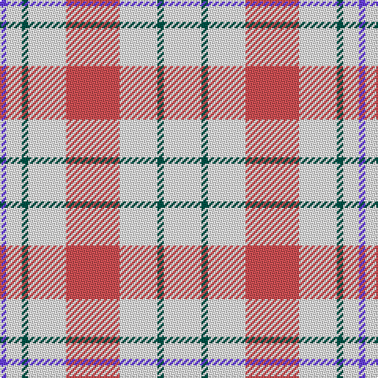

The parent of this is [Milne (Personal)](/tartans/p/4/w10/g4/w24/do34/w24/g4/w/24/)

This was sourced from tartans-authority.  It is a [8 stripes tartan](/stripes/stripes8/).

Original link http://www.tartansauthority.com/tartan-ferret/display/634/

## Thread count
P/4 W10 G4 W24 DO34 W24 G4 W/24

## Palette
Each colour and its ΔE from the base-6 reference it is a variant of.

| Colour | Shade | Base | ΔE (OKLab) |
|---|---|---|---|
| DO |  `#D05054` | R  | 0.10 |
| G |  `#005448` | G  | 0.11 |
| P |  `#6840FC` | B  | 0.21 |
| W |  `#FCFCFC` | W  | 0.03 |

# Sample pattern

ID: /variants/p/4/w10/g4/w24/do34/w24/g4/w/24-dod05054-g005448-p6840fc-wfcfcfc/
