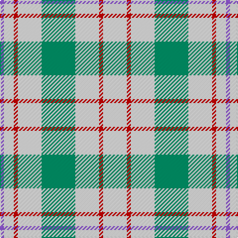

The parent of this is [Milne, Green (Dance)](/tartans/p/4/w10/r4/w24/b34/w24/r4/w/24/)

This was sourced from tartans-authority.  It is a [8 stripes tartan](/stripes/stripes8/).

Original link http://www.tartansauthority.com/tartan-ferret/display/6549/

## Thread count
P/4 W10 R4 W24 B34 W24 R4 W/24

## Palette
Each colour and its ΔE from the base-6 reference it is a variant of.

| Colour | Shade | Base | ΔE (OKLab) |
|---|---|---|---|
| B |  `#009468` | G  | 0.16 |
| P |  `#9058D8` | B  | 0.22 |
| R |  `#C80000` | R  | 0.00 |
| W |  `#F8F8F8` | W  | 0.01 |

# Sample pattern

ID: /variants/p/4/w10/r4/w24/b34/w24/r4/w/24-b009468-p9058d8-rc80000-wf8f8f8/
