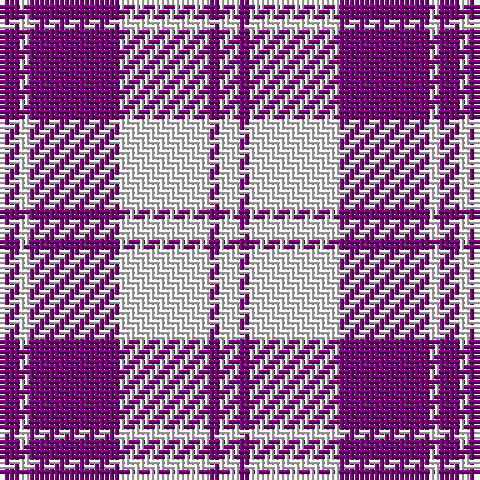

The parent of this is [Erskine, Purple (Dance)](/tartans/p/4/w2/p18/w18/p2/w/4/)

This was sourced from tartans-authority.  It is a [6 stripes tartan](/stripes/stripes6/).

Original link http://www.tartansauthority.com/tartan-ferret/display/6534/

## Thread count
P/4 W2 P18 W18 P2 W/4

## Palette
Each colour and its ΔE from the base-6 reference it is a variant of.

| Colour | Shade | Base | ΔE (OKLab) |
|---|---|---|---|
| P |  `#780078` | B  | 0.16 |
| W |  `#F8F8F8` | W  | 0.01 |

# Sample pattern

ID: /variants/p/4/w2/p18/w18/p2/w/4-p780078-wf8f8f8/
