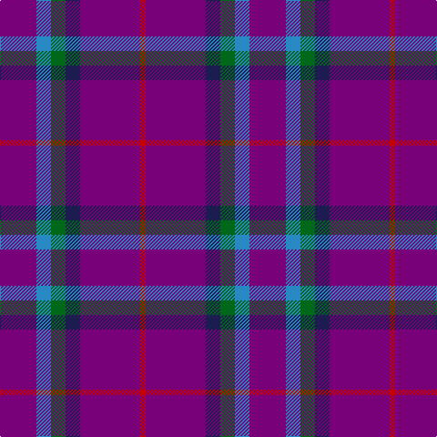

The parent of this is [McIntosh, Stuart (Personal)](/tartans/p/40/b16/g16/db16/p66/r/6/)

This was sourced from tartans-authority.  It is a [6 stripes tartan](/stripes/stripes6/).

Original link http://www.tartansauthority.com/tartan-ferret/display/10215/

## Thread count
P/40 B16 G16 DB16 P66 R/6

## Palette
Each colour and its ΔE from the base-6 reference it is a variant of.

| Colour | Shade | Base | ΔE (OKLab) |
|---|---|---|---|
| B |  `#2888C4` | B  | 0.21 |
| DB |  `#1C1C50` | B  | 0.14 |
| G |  `#006818` | G  | 0.02 |
| P |  `#780078` | B  | 0.16 |
| R |  `#C80000` | R  | 0.00 |

# Sample pattern

ID: /variants/p/40/b16/g16/db16/p66/r/6-b2888c4-db1c1c50-g006818-p780078-rc80000/
