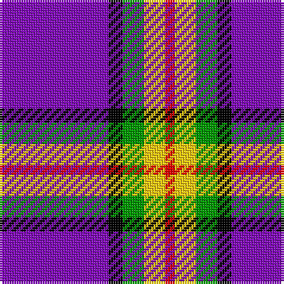

The parent of this is [Ayllu Thuban](/tartans/p/46/k6/g9/y9/r/4/)

This was sourced from register-of-tartans.  It is a [5 stripes tartan](/stripes/stripes5/).

Original link https://www.tartanregister.gov.uk/tartanDetails.aspx?ref=10626

## Thread count
P/46 K6 G9 Y9 R/4

## Palette
Each colour and its ΔE from the base-6 reference it is a variant of.

| Colour | Shade | Base | ΔE (OKLab) |
|---|---|---|---|
| G |  `#009900` | G  | 0.16 |
| K |  `#000000` | K  | 0.00 |
| P |  `#820BBB` | B  | 0.18 |
| R |  `#EE0000` | R  | 0.08 |
| Y |  `#FFCC11` | Y  | 0.05 |

# Sample pattern

ID: /variants/p/46/k6/g9/y9/r/4-g009900-k000000-p820bbb-ree0000-yffcc11/
