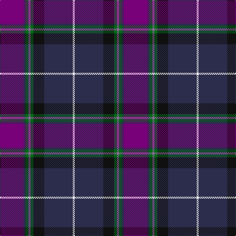

The parent of this is [Alba (Fashion)](/tartans/p/48/db4/g6/lp4/g6/k22/db58/w/4/)

This was sourced from tartans-authority.  It is a [8 stripes tartan](/stripes/stripes8/).

Original link http://www.tartansauthority.com/tartan-ferret/display/3825/

## Thread count
P/48 DB4 G6 LP4 G6 K22 DB58 W/4

## Palette
Each colour and its ΔE from the base-6 reference it is a variant of.

| Colour | Shade | Base | ΔE (OKLab) |
|---|---|---|---|
| DB |  `#2C2C4C` | B  | 0.11 |
| G |  `#006818` | G  | 0.02 |
| K |  `#101010` | K  | 0.17 |
| LP |  `#9C68A4` | R  | 0.21 |
| P |  `#780078` | B  | 0.16 |
| W |  `#FCFCFC` | W  | 0.03 |

# Sample pattern

ID: /variants/p/48/db4/g6/lp4/g6/k22/db58/w/4-db2c2c4c-g006818-k101010-lp9c68a4-p780078-wfcfcfc/
