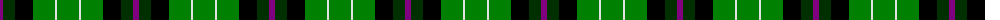

The parent of this is [Hibernian F.C.](/tartans/p/6/dg12/k18/g22/ln2/g22/ln2/g22/k18/dg12/p/6/)

This was sourced from weddslist.  It is a [11 stripes tartan](/stripes/stripes11/).

Original link http://www.weddslist.com/cgi-bin/tartans/pg.pl?source=sts

## Thread count
P/6 DG12 K18 G22 LN2 G22 LN2 G22 K18 DG12 P/6

## Palette
Each colour and its ΔE from the base-6 reference it is a variant of.

| Colour | Shade | Base | ΔE (OKLab) |
|---|---|---|---|
| DG |  `#003000` | G  | 0.18 |
| G |  `#008000` | G  | 0.09 |
| K |  `#000000` | K  | 0.00 |
| LN |  `#E0E0E0` | W  | 0.06 |
| P |  `#800080` | B  | 0.17 |

ID: /variants/p/6/dg12/k18/g22/ln2/g22/ln2/g22/k18/dg12/p/6-dg003000-g008000-k000000-lne0e0e0-p800080/
