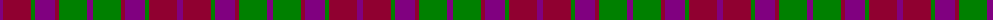

The parent of this is [Scottish Netball Association](/tartans/p/6/dr28/g4/p20/dr4/g28/p/6/)

This was sourced from weddslist.  It is a [7 stripes tartan](/stripes/stripes7/).

Original link http://www.weddslist.com/cgi-bin/tartans/pg.pl?source=sts

## Thread count
P/6 DR28 G4 P20 DR4 G28 P/6

## Palette
Each colour and its ΔE from the base-6 reference it is a variant of.

| Colour | Shade | Base | ΔE (OKLab) |
|---|---|---|---|
| DR |  `#900030` | R  | 0.13 |
| G |  `#008000` | G  | 0.09 |
| P |  `#800080` | B  | 0.17 |

# Sample pattern

ID: /variants/p/6/dr28/g4/p20/dr4/g28/p/6-dr900030-g008000-p800080/
