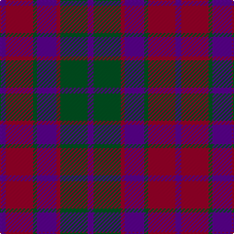

The parent of this is [Scottish Netball Association](/tartans/p/6/dr28/g4/p20/dr4/g28/p/6/)

This was sourced from register-of-tartans.  It is a [7 stripes tartan](/stripes/stripes7/).

Original link https://www.tartanregister.gov.uk/tartanDetails.aspx?ref=3733

## Thread count
P/6 DR28 G4 P20 DR4 G28 P/6

## Palette
Each colour and its ΔE from the base-6 reference it is a variant of.

| Colour | Shade | Base | ΔE (OKLab) |
|---|---|---|---|
| DR |  `#960028` | R  | 0.11 |
| G |  `#005020` | G  | 0.08 |
| P |  `#5A008C` | B  | 0.12 |

# Sample pattern

ID: /variants/p/6/dr28/g4/p20/dr4/g28/p/6-dr960028-g005020-p5a008c/
