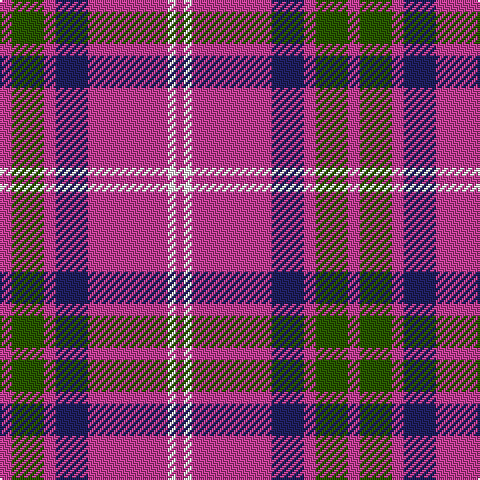

The parent of this is [Unnamed C21st (Lady's Jacket) (Fash)](/tartans/p/6/g16/p6/db16/p40/w4/p/4/)

This was sourced from tartans-authority.  It is a [7 stripes tartan](/stripes/stripes7/).

Original link http://www.tartansauthority.com/tartan-ferret/display/8417/

## Thread count
P/6 G16 P6 DB16 P40 W4 P/4

## Palette
Each colour and its ΔE from the base-6 reference it is a variant of.

| Colour | Shade | Base | ΔE (OKLab) |
|---|---|---|---|
| DB |  `#202060` | B  | 0.11 |
| G |  `#285800` | G  | 0.04 |
| P |  `#C04094` | R  | 0.17 |
| W |  `#FCFCFC` | W  | 0.03 |

# Sample pattern

ID: /variants/p/6/g16/p6/db16/p40/w4/p/4-db202060-g285800-pc04094-wfcfcfc/
