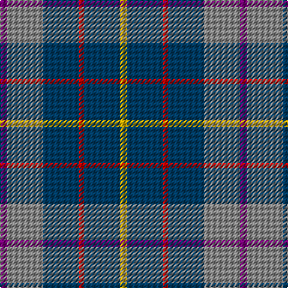

The parent of this is [HMS Duncan (Military)](/tartans/p/6/n30/db30/r4/db30/y/6/)

This was sourced from tartans-authority.  It is a [6 stripes tartan](/stripes/stripes6/).

Original link http://www.tartansauthority.com/tartan-ferret/display/10268/

## Thread count
P/6 N30 DB30 R4 DB30 Y/6

## Palette
Each colour and its ΔE from the base-6 reference it is a variant of.

| Colour | Shade | Base | ΔE (OKLab) |
|---|---|---|---|
| DB |  `#003C64` | B  | 0.07 |
| N |  `#888888` | R  | 0.24 |
| P |  `#780078` | B  | 0.16 |
| R |  `#C80000` | R  | 0.00 |
| Y |  `#CCA800` | Y  | 0.08 |

# Sample pattern

ID: /variants/p/6/n30/db30/r4/db30/y/6-db003c64-n888888-p780078-rc80000-ycca800/
