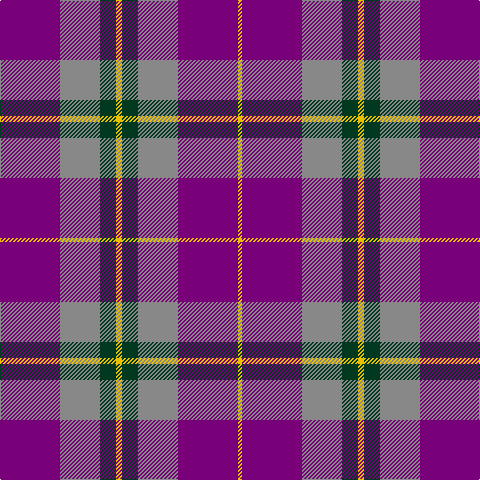

The parent of this is [Wicks (Personal)](/tartans/p/60/n40/dg16/y6/dg16/n40/p60/y/4/)

This was sourced from register-of-tartans.  It is a [8 stripes tartan](/stripes/stripes8/).

Original link https://www.tartanregister.gov.uk/tartanDetails.aspx?ref=4622

## Thread count
P/60 N40 DG16 Y6 DG16 N40 P60 Y/4

## Palette
Each colour and its ΔE from the base-6 reference it is a variant of.

| Colour | Shade | Base | ΔE (OKLab) |
|---|---|---|---|
| B |  `#48A4C0` | Y  | 0.28 |
| DG |  `#003820` | G  | 0.16 |
| LR |  `#E8CCB8` | W  | 0.11 |
| N |  `#888888` | R  | 0.24 |
| P |  `#780078` | B  | 0.16 |
| Y |  `#E8C000` | Y  | 0.00 |

# Sample pattern

ID: /variants/p/60/n40/dg16/y6/dg16/n40/p60/y/4-b48a4c0-dg003820-lre8ccb8-n888888-p780078-ye8c000/
