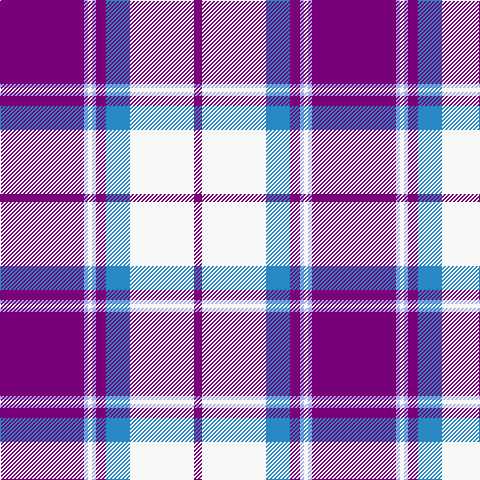

The parent of this is [Longniddry Purple](/tartans/p/84/lp4/w4/lp4/p10/b24/w64/p/8/)

This was sourced from register-of-tartans.  It is a [8 stripes tartan](/stripes/stripes8/).

Original link https://www.tartanregister.gov.uk/tartanDetails.aspx?ref=2211

## Thread count
P/84 LP4 W4 LP4 P10 B24 W64 P/8

## Palette
Each colour and its ΔE from the base-6 reference it is a variant of.

| Colour | Shade | Base | ΔE (OKLab) |
|---|---|---|---|
| B |  `#2888C4` | B  | 0.21 |
| LP |  `#A8ACE8` | W  | 0.22 |
| P |  `#780078` | B  | 0.16 |
| W |  `#F8F8F8` | W  | 0.01 |

# Sample pattern

ID: /variants/p/84/lp4/w4/lp4/p10/b24/w64/p/8-b2888c4-lpa8ace8-p780078-wf8f8f8/
