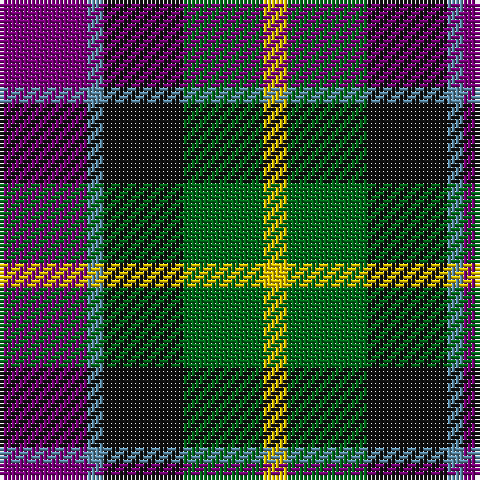

The parent of this is [Nobiliary Fraternity](/tartans/pa/22/ba4/k20/g20/y/6/)

This was sourced from register-of-tartans.  It is a [5 stripes tartan](/stripes/stripes5/).

Original link https://www.tartanregister.gov.uk/tartanDetails.aspx?ref=3144

## Thread count
Pa/22 Ba4 K20 G20 Y/6

## Palette
Each colour and its ΔE from the base-6 reference it is a variant of.

| Colour | Shade | Base | ΔE (OKLab) |
|---|---|---|---|
| B |  `#2888C4` | B  | 0.21 |
| Ba |  `#5C8CA8` | B  | 0.23 |
| DG |  `#003820` | G  | 0.16 |
| DP |  `#440044` | B  | 0.17 |
| G |  `#006818` | G  | 0.02 |
| K |  `#101010` | K  | 0.17 |
| P |  `#9050D8` | B  | 0.22 |
| Pa |  `#780078` | B  | 0.16 |
| Y |  `#E8C000` | Y  | 0.00 |

# Sample pattern

ID: /variants/pa/22/ba4/k20/g20/y/6-b2888c4-ba5c8ca8-dg003820-dp440044-g006818-k101010-p9050d8-pa780078-ye8c000/
