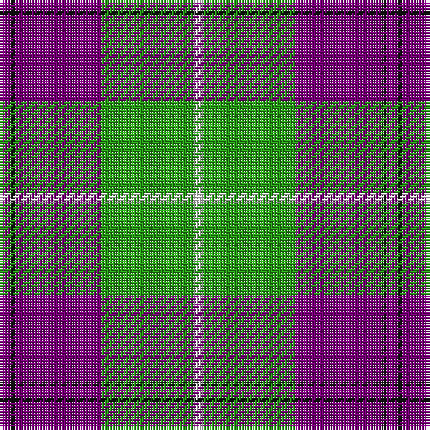

The parent of this is [Kansai Highland Games](/tartans/pa/4/k2/pa32/g34/w/4/)

This was sourced from register-of-tartans.  It is a [5 stripes tartan](/stripes/stripes5/).

Original link https://www.tartanregister.gov.uk/tartanDetails.aspx?ref=1928

## Thread count
Pa/4 K2 Pa32 G34 W/4

## Palette
Each colour and its ΔE from the base-6 reference it is a variant of.

| Colour | Shade | Base | ΔE (OKLab) |
|---|---|---|---|
| G |  `#289C18` | G  | 0.18 |
| K |  `#101010` | K  | 0.17 |
| P |  `#B468AC` | R  | 0.21 |
| Pa |  `#780078` | B  | 0.16 |
| W |  `#FCFCFC` | W  | 0.03 |

# Sample pattern

ID: /variants/pa/4/k2/pa32/g34/w/4-g289c18-k101010-pb468ac-pa780078-wfcfcfc/
