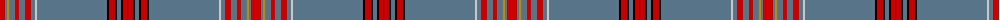

The parent of this is [Crieff High (Corporate)](/tartans/r/10/b2/dy2/b6/r4/b6/r6/b4/n2/b70/k2/r6/k2/b4/k2/r/10/)

This was sourced from tartans-authority.  It is a [16 stripes tartan](/stripes/stripes16/).

Original link http://www.tartansauthority.com/tartan-ferret/display/8041/

## Thread count
R/10 B2 DY2 B6 R4 B6 R6 B4 N2 B70 K2 R6 K2 B4 K2 R/10

## Palette
Each colour and its ΔE from the base-6 reference it is a variant of.

| Colour | Shade | Base | ΔE (OKLab) |
|---|---|---|---|
| B |  `#587488` | B  | 0.17 |
| DY |  `#BC8C00` | Y  | 0.16 |
| K |  `#000000` | K  | 0.00 |
| N |  `#C8C8C8` | W  | 0.13 |
| R |  `#C80000` | R  | 0.00 |

ID: /variants/r/10/b2/dy2/b6/r4/b6/r6/b4/n2/b70/k2/r6/k2/b4/k2/r/10-b587488-dybc8c00-k000000-nc8c8c8-rc80000/
