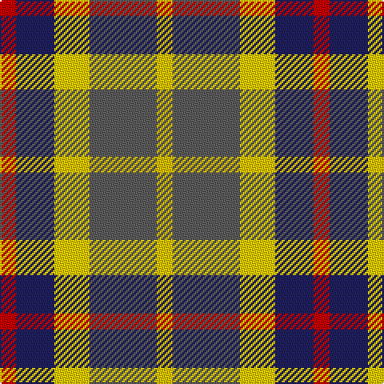

The parent of this is [Inspiration](/tartans/r/10/db24/y22/n42/ya/10/)

This was sourced from tartans-authority.  It is a [5 stripes tartan](/stripes/stripes5/).

Original link http://www.tartansauthority.com/tartan-ferret/display/10893/

## Thread count
R/10 DB24 Y22 N42 Ya/10

## Palette
Each colour and its ΔE from the base-6 reference it is a variant of.

| Colour | Shade | Base | ΔE (OKLab) |
|---|---|---|---|
| DB |  `#202060` | B  | 0.11 |
| N |  `#5C5C5C` | B  | 0.14 |
| R |  `#C80000` | R  | 0.00 |
| Y |  `#FCCC00` | Y  | 0.04 |
| Ya |  `#E8C000` | Y  | 0.00 |

# Sample pattern

ID: /variants/r/10/db24/y22/n42/ya/10-db202060-n5c5c5c-rc80000-yfccc00-yae8c000/
