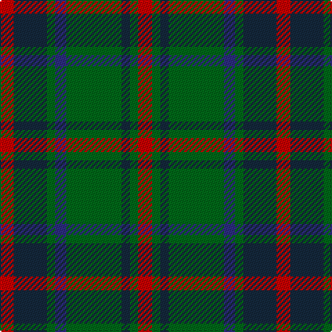

The parent of this is [Daks (0600150)](/tartans/r/10/dn24/g6/db8/g40/dn6/g6/r/10/)

This was sourced from register-of-tartans.  It is a [8 stripes tartan](/stripes/stripes8/).

Original link https://www.tartanregister.gov.uk/tartanDetails.aspx?ref=863

## Thread count
R/10 DN24 G6 DB8 G40 DN6 G6 R/10

## Palette
Each colour and its ΔE from the base-6 reference it is a variant of.

| Colour | Shade | Base | ΔE (OKLab) |
|---|---|---|---|
| DB |  `#2C2C80` | B  | 0.05 |
| DN |  `#14283C` | B  | 0.14 |
| G |  `#006818` | G  | 0.02 |
| R |  `#C80000` | R  | 0.00 |

# Sample pattern

ID: /variants/r/10/dn24/g6/db8/g40/dn6/g6/r/10-db2c2c80-dn14283c-g006818-rc80000/
