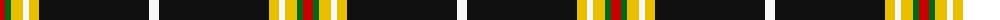
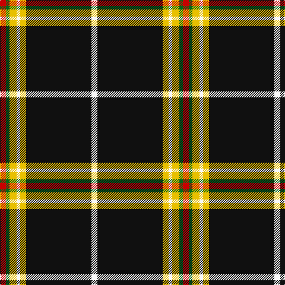

The parent of this is [Avalon (Corporate)](/tartans/r/10/g6/y12/w6/y10/k110/w/10/)

This was sourced from tartans-authority.  It is a [7 stripes tartan](/stripes/stripes7/).

Original link http://www.tartansauthority.com/tartan-ferret/display/6361/

## Thread count
R/10 G6 Y12 W6 Y10 K110 W/10

## Palette
Each colour and its ΔE from the base-6 reference it is a variant of.

| Colour | Shade | Base | ΔE (OKLab) |
|---|---|---|---|
| G |  `#006818` | G  | 0.02 |
| K |  `#101010` | K  | 0.17 |
| R |  `#C80000` | R  | 0.00 |
| W |  `#F8F8F8` | W  | 0.01 |
| Y |  `#E8C000` | Y  | 0.00 |

# Sample pattern

ID: /variants/r/10/g6/y12/w6/y10/k110/w/10-g006818-k101010-rc80000-wf8f8f8-ye8c000/
