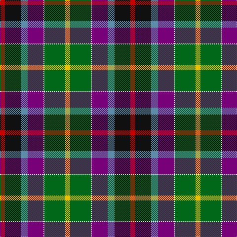

The parent of this is [Gallowater New District Tartan Tartan Number: 1571. Earliest known date: 1819 The Gallowater district tartan, sometimes referred to as the 'Gala Water' was first mentioned in the records of Wilson's of Bannockburn in 1793. The design progressed until 1819 when this 'New' sett was recorded in the company's pattern book with a red band and a thin white stripe. See products available Copyright © Blair Urquhart, Comrie, 2015](/tartans/r/10/k32/b14/p32/ln2/g42/y/10/)

This was sourced from house-of-tartan.  It is a [7 stripes tartan](/stripes/stripes7/).

Original link http://www.house-of-tartan.scotland.net/house/TartanViewjs.asp?colr=Def&tnam=1571

## Thread count
R/10 K32 B14 P32 LN2 G42 Y/10

## Palette
Each colour and its ΔE from the base-6 reference it is a variant of.

| Colour | Shade | Base | ΔE (OKLab) |
|---|---|---|---|
| B |  `#5C8CA8` | B  | 0.23 |
| G |  `#006818` | G  | 0.02 |
| K |  `#101010` | K  | 0.17 |
| LN |  `#E0E0E0` | W  | 0.06 |
| P |  `#780078` | B  | 0.16 |
| R |  `#C80000` | R  | 0.00 |
| Y |  `#E8C000` | Y  | 0.00 |

# Sample pattern

ID: /variants/r/10/k32/b14/p32/ln2/g42/y/10-b5c8ca8-g006818-k101010-lne0e0e0-p780078-rc80000-ye8c000/
