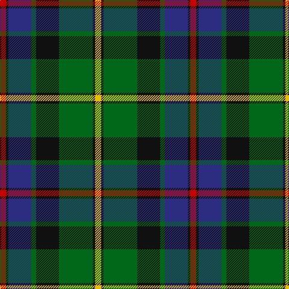

The parent of this is [Tait #1 (Name)](/tartans/r/10/k4/db38/g8/k38/g56/k4/y/10/)

This was sourced from tartans-authority.  It is a [8 stripes tartan](/stripes/stripes8/).

Original link http://www.tartansauthority.com/tartan-ferret/display/5949/

## Thread count
R/10 K4 DB38 G8 K38 G56 K4 Y/10

## Palette
Each colour and its ΔE from the base-6 reference it is a variant of.

| Colour | Shade | Base | ΔE (OKLab) |
|---|---|---|---|
| DB |  `#2C2C80` | B  | 0.05 |
| G |  `#006818` | G  | 0.02 |
| K |  `#101010` | K  | 0.17 |
| R |  `#C80000` | R  | 0.00 |
| Y |  `#E8C000` | Y  | 0.00 |

# Sample pattern

ID: /variants/r/10/k4/db38/g8/k38/g56/k4/y/10-db2c2c80-g006818-k101010-rc80000-ye8c000/
