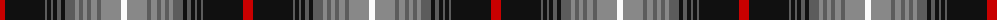

The parent of this is [Nike Golf Dark (Corporate)](/tartans/r/10/k40/n2/k4/n2/k4/n4/k4/n10/na4/n4/na4/n4/na6/n4/na20/w/6/)

This was sourced from tartans-authority.  It is a [17 stripes tartan](/stripes/stripes17/).

Original link http://www.tartansauthority.com/tartan-ferret/display/10569/

## Thread count
R/10 K40 N2 K4 N2 K4 N4 K4 N10 Na4 N4 Na4 N4 Na6 N4 Na20 W/6

## Palette
Each colour and its ΔE from the base-6 reference it is a variant of.

| Colour | Shade | Base | ΔE (OKLab) |
|---|---|---|---|
| K |  `#101010` | K  | 0.17 |
| N |  `#5C5C5C` | B  | 0.14 |
| Na |  `#888888` | R  | 0.24 |
| R |  `#C80000` | R  | 0.00 |
| W |  `#FCFCFC` | W  | 0.03 |

ID: /variants/r/10/k40/n2/k4/n2/k4/n4/k4/n10/na4/n4/na4/n4/na6/n4/na20/w/6-k101010-n5c5c5c-na888888-rc80000-wfcfcfc/
