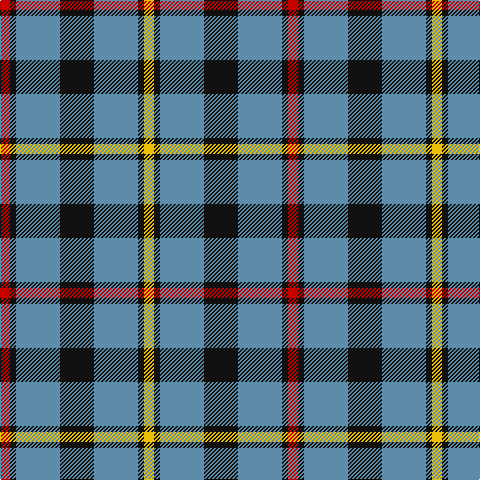

The parent of this is [MacCrimmon from Skye (Clan?)](/tartans/r/10/k6/b44/k34/b44/k6/y/10/)

This was sourced from tartans-authority.  It is a [7 stripes tartan](/stripes/stripes7/).

Original link http://www.tartansauthority.com/tartan-ferret/display/2610/

## Thread count
R/10 K6 B44 K34 B44 K6 Y/10

## Palette
Each colour and its ΔE from the base-6 reference it is a variant of.

| Colour | Shade | Base | ΔE (OKLab) |
|---|---|---|---|
| B |  `#5C8CA8` | B  | 0.23 |
| K |  `#101010` | K  | 0.17 |
| R |  `#C80000` | R  | 0.00 |
| Y |  `#E8C000` | Y  | 0.00 |

# Sample pattern

ID: /variants/r/10/k6/b44/k34/b44/k6/y/10-b5c8ca8-k101010-rc80000-ye8c000/
