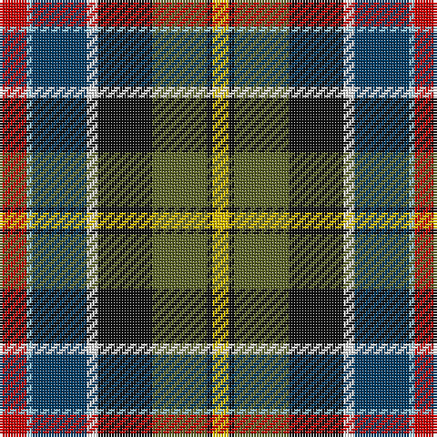

The parent of this is [Culloden - 1746 (Original)](/tartans/r/10/lb2/db20/w4/k20/g20/k2/y/6/)

This was sourced from tartans-authority.  It is a [8 stripes tartan](/stripes/stripes8/).

Original link http://www.tartansauthority.com/tartan-ferret/display/7422/

## Thread count
R/10 LB2 DB20 W4 K20 G20 K2 Y/6

## Palette
Each colour and its ΔE from the base-6 reference it is a variant of.

| Colour | Shade | Base | ΔE (OKLab) |
|---|---|---|---|
| DB |  `#003C64` | B  | 0.07 |
| G |  `#5C6428` | G  | 0.09 |
| K |  `#101010` | K  | 0.17 |
| LB |  `#98C8E8` | W  | 0.17 |
| R |  `#C80000` | R  | 0.00 |
| W |  `#FCFCFC` | W  | 0.03 |
| Y |  `#E8C000` | Y  | 0.00 |

# Sample pattern

ID: /variants/r/10/lb2/db20/w4/k20/g20/k2/y/6-db003c64-g5c6428-k101010-lb98c8e8-rc80000-wfcfcfc-ye8c000/
