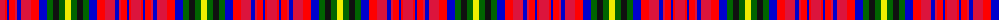

The parent of this is [MacEochaidh (Personal)](/tartans/r/10/ra2/b2/ra6/r2/b4/r10/ra8/b8/g6/k6/g6/y/6/)

This was sourced from register-of-tartans.  It is a [13 stripes tartan](/stripes/stripes13/).

Original link https://www.tartanregister.gov.uk/tartanDetails.aspx?ref=10147

## Thread count
R/10 Ra2 B2 Ra6 R2 B4 R10 Ra8 B8 G6 K6 G6 Y/6

## Palette
Each colour and its ΔE from the base-6 reference it is a variant of.

| Colour | Shade | Base | ΔE (OKLab) |
|---|---|---|---|
| B |  `#0000CD` | B  | 0.15 |
| G |  `#006400` | G  | 0.00 |
| K |  `#101010` | K  | 0.17 |
| R |  `#DC143C` | R  | 0.06 |
| Ra |  `#FF0000` | R  | 0.11 |
| Y |  `#EEEE00` | Y  | 0.12 |

ID: /variants/r/10/ra2/b2/ra6/r2/b4/r10/ra8/b8/g6/k6/g6/y/6-b0000cd-g006400-k101010-rdc143c-raff0000-yeeee00/
