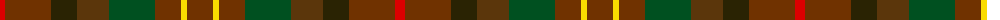
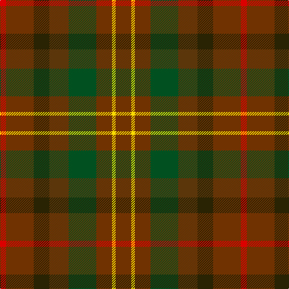

The parent of this is [Unidentified #40](/tartans/r/10/t46/k26/ta32/g46/t26/y6/t/26/)

This was sourced from register-of-tartans.  It is a [8 stripes tartan](/stripes/stripes8/).

Original link https://www.tartanregister.gov.uk/tartanDetails.aspx?ref=4241

## Thread count
R/10 T46 K26 Ta32 G46 T26 Y6 T/26

## Palette
Each colour and its ΔE from the base-6 reference it is a variant of.

| Colour | Shade | Base | ΔE (OKLab) |
|---|---|---|---|
| G |  `#005020` | G  | 0.08 |
| K |  `#2A2303` | B  | 0.21 |
| R |  `#DC0000` | R  | 0.04 |
| T |  `#703200` | R  | 0.18 |
| Ta |  `#5B360B` | G  | 0.17 |
| Y |  `#FADC00` | Y  | 0.08 |

# Sample pattern

ID: /variants/r/10/t46/k26/ta32/g46/t26/y6/t/26-g005020-k2a2303-rdc0000-t703200-ta5b360b-yfadc00/
