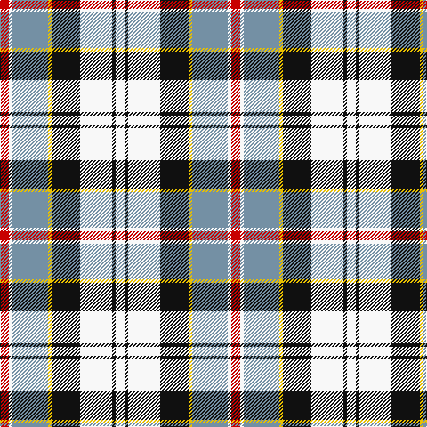

The parent of this is [Ailsa Craig (District)](/tartans/r/10/w4/b40/y4/k32/w36/k4/w/10/)

This was sourced from tartans-authority.  It is a [8 stripes tartan](/stripes/stripes8/).

Original link http://www.tartansauthority.com/tartan-ferret/display/1673/

## Thread count
R/10 W4 B40 Y4 K32 W36 K4 W/10

## Palette
Each colour and its ΔE from the base-6 reference it is a variant of.

| Colour | Shade | Base | ΔE (OKLab) |
|---|---|---|---|
| B |  `#7490A4` | B  | 0.26 |
| K |  `#101010` | K  | 0.17 |
| R |  `#C80000` | R  | 0.00 |
| W |  `#F8F8F8` | W  | 0.01 |
| Y |  `#E8C000` | Y  | 0.00 |

# Sample pattern

ID: /variants/r/10/w4/b40/y4/k32/w36/k4/w/10-b7490a4-k101010-rc80000-wf8f8f8-ye8c000/
