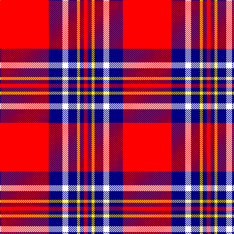

The parent of this is [Texas Lone Star](/tartans/r/100/db28/w12/db18/y6/db8/r/8/)

This was sourced from register-of-tartans.  It is a [7 stripes tartan](/stripes/stripes7/).

Original link https://www.tartanregister.gov.uk/tartanDetails.aspx?ref=10726

## Thread count
R/100 DB28 W12 DB18 Y6 DB8 R/8

## Palette
Each colour and its ΔE from the base-6 reference it is a variant of.

| Colour | Shade | Base | ΔE (OKLab) |
|---|---|---|---|
| DB |  `#000080` | B  | 0.14 |
| R |  `#FF0000` | R  | 0.11 |
| W |  `#FFFFFF` | W  | 0.03 |
| Y |  `#FFE600` | Y  | 0.10 |

# Sample pattern

ID: /variants/r/100/db28/w12/db18/y6/db8/r/8-db000080-rff0000-wffffff-yffe600/
