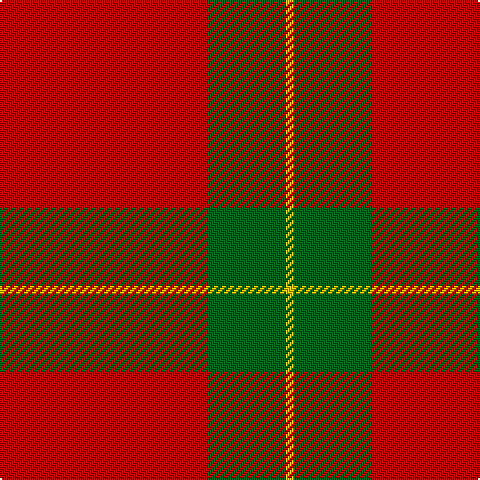

The parent of this is [Scottish Watch General Tartan Tartan Number: 1561. Earliest known date: pre 2003 Half actual count See products available Copyright © Blair Urquhart, Comrie, 2015](/tartans/r/104/g39/y/4/)

This was sourced from house-of-tartan.  It is a [3 stripes tartan](/stripes/stripes3/).

Original link http://www.house-of-tartan.scotland.net/house/TartanViewjs.asp?colr=Def&tnam=1561

## Thread count
R/104 G39 Y/4

## Palette
Each colour and its ΔE from the base-6 reference it is a variant of.

| Colour | Shade | Base | ΔE (OKLab) |
|---|---|---|---|
| G |  `#006818` | G  | 0.02 |
| R |  `#C80000` | R  | 0.00 |
| Y |  `#E8C000` | Y  | 0.00 |

# Sample pattern

ID: /variants/r/104/g39/y/4-g006818-rc80000-ye8c000/
