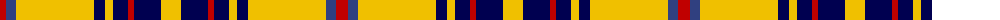

The parent of this is [Bracken](/tartans/r/12/b10/y78/db11/y8/db15/r6/db27/y/20/)

This was sourced from weddslist.  It is a [9 stripes tartan](/stripes/stripes9/).

Original link http://www.weddslist.com/cgi-bin/tartans/pg.pl?source=sts

## Thread count
R/12 B10 Y78 DB11 Y8 DB15 R6 DB27 Y/20

## Palette
Each colour and its ΔE from the base-6 reference it is a variant of.

| Colour | Shade | Base | ΔE (OKLab) |
|---|---|---|---|
| B |  `#304080` | B  | 0.01 |
| DB |  `#000050` | B  | 0.20 |
| R |  `#C00000` | R  | 0.02 |
| Y |  `#F0C000` | Y  | 0.01 |

ID: /variants/r/12/b10/y78/db11/y8/db15/r6/db27/y/20-b304080-db000050-rc00000-yf0c000/
