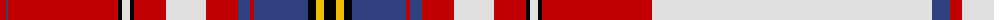

The parent of this is [Unidentified, Plaid arisaid](/tartans/r/12/b2/r110/k4/ln8/k4/r32/ln40/r32/b12/r4/b54/k8/y8/k12/y8/k8/b54/r4/b12/r32/ln40/r32/k4/ln8/k4/r110/ln280/b18/r12/ln32/r12/b2/r12/ln32/r/12/)

This was sourced from weddslist.  It is a [36 stripes tartan](/stripes/stripes36/).

Original link http://www.weddslist.com/cgi-bin/tartans/pg.pl?source=sts

## Thread count
R/12 B2 R110 K4 LN8 K4 R32 LN40 R32 B12 R4 B54 K8 Y8 K12 Y8 K8 B54 R4 B12 R32 LN40 R32 K4 LN8 K4 R110 LN280 B18 R12 LN32 R12 B2 R12 LN32 R/12

## Palette
Each colour and its ΔE from the base-6 reference it is a variant of.

| Colour | Shade | Base | ΔE (OKLab) |
|---|---|---|---|
| B |  `#304080` | B  | 0.01 |
| K |  `#000000` | K  | 0.00 |
| LN |  `#E0E0E0` | W  | 0.06 |
| R |  `#C00000` | R  | 0.02 |
| Y |  `#F0C000` | Y  | 0.01 |

ID: /variants/r/12/b2/r110/k4/ln8/k4/r32/ln40/r32/b12/r4/b54/k8/y8/k12/y8/k8/b54/r4/b12/r32/ln40/r32/k4/ln8/k4/r110/ln280/b18/r12/ln32/r12/b2/r12/ln32/r/12-b304080-k000000-lne0e0e0-rc00000-yf0c000/
