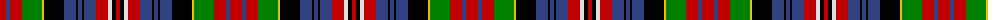

The parent of this is [MacPherson 10](/tartans/r/12/b4/r12/g20/y2/k20/b12/k2/b4/k2/b12/r12/ln4/k4/r/4/)

This was sourced from weddslist.  It is a [15 stripes tartan](/stripes/stripes15/).

Original link http://www.weddslist.com/cgi-bin/tartans/pg.pl?source=sts

## Thread count
R/12 B4 R12 G20 Y2 K20 B12 K2 B4 K2 B12 R12 LN4 K4 R/4

## Palette
Each colour and its ΔE from the base-6 reference it is a variant of.

| Colour | Shade | Base | ΔE (OKLab) |
|---|---|---|---|
| B |  `#304080` | B  | 0.01 |
| G |  `#008000` | G  | 0.09 |
| K |  `#000000` | K  | 0.00 |
| LN |  `#E0E0E0` | W  | 0.06 |
| R |  `#C00000` | R  | 0.02 |
| Y |  `#F0C000` | Y  | 0.01 |

ID: /variants/r/12/b4/r12/g20/y2/k20/b12/k2/b4/k2/b12/r12/ln4/k4/r/4-b304080-g008000-k000000-lne0e0e0-rc00000-yf0c000/
