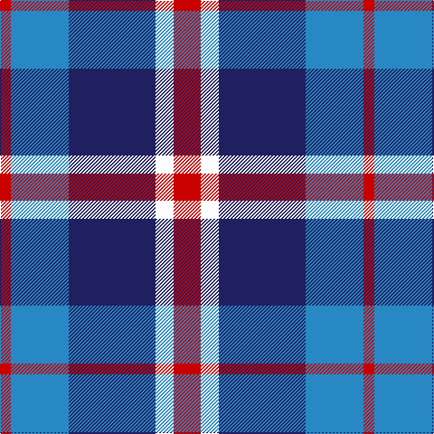

The parent of this is [Lands of Liberty (Fashion)](/tartans/r/12/b64/db96/w20/r/30/)

This was sourced from tartans-authority.  It is a [5 stripes tartan](/stripes/stripes5/).

Original link http://www.tartansauthority.com/tartan-ferret/display/10928/

## Thread count
R/12 B64 DB96 W20 R/30

## Palette
Each colour and its ΔE from the base-6 reference it is a variant of.

| Colour | Shade | Base | ΔE (OKLab) |
|---|---|---|---|
| B |  `#2888C4` | B  | 0.21 |
| DB |  `#202060` | B  | 0.11 |
| R |  `#C80000` | R  | 0.00 |
| W |  `#FCFCFC` | W  | 0.03 |

# Sample pattern

ID: /variants/r/12/b64/db96/w20/r/30-b2888c4-db202060-rc80000-wfcfcfc/
