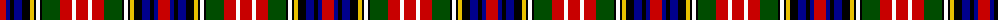

The parent of this is [Christie (Clan)](/tartans/r/12/db4/k4/db8/k8/y4/k2/w4/k2/g18/r12/w4/r/12/)

This was sourced from tartans-authority.  It is a [13 stripes tartan](/stripes/stripes13/).

Original link http://www.tartansauthority.com/tartan-ferret/display/1355/

## Thread count
R/12 DB4 K4 DB8 K8 Y4 K2 W4 K2 G18 R12 W4 R/12

## Palette
Each colour and its ΔE from the base-6 reference it is a variant of.

| Colour | Shade | Base | ΔE (OKLab) |
|---|---|---|---|
| DB |  `#00008C` | B  | 0.13 |
| G |  `#004C00` | G  | 0.08 |
| K |  `#000000` | K  | 0.00 |
| R |  `#C80000` | R  | 0.00 |
| W |  `#FCFCFC` | W  | 0.03 |
| Y |  `#E8C000` | Y  | 0.00 |

ID: /variants/r/12/db4/k4/db8/k8/y4/k2/w4/k2/g18/r12/w4/r/12-db00008c-g004c00-k000000-rc80000-wfcfcfc-ye8c000/
