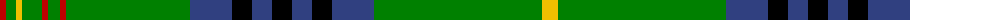

The parent of this is [King Edward VII](/tartans/r/12/g10/y6/g20/r6/g12/r6/g124/b42/k20/b20/k20/b20/k20/b42/g168/y/16/)

This was sourced from weddslist.  It is a [17 stripes tartan](/stripes/stripes17/).

Original link http://www.weddslist.com/cgi-bin/tartans/pg.pl?source=sts

## Thread count
R/12 G10 Y6 G20 R6 G12 R6 G124 B42 K20 B20 K20 B20 K20 B42 G168 Y/16

## Palette
Each colour and its ΔE from the base-6 reference it is a variant of.

| Colour | Shade | Base | ΔE (OKLab) |
|---|---|---|---|
| B |  `#304080` | B  | 0.01 |
| G |  `#008000` | G  | 0.09 |
| K |  `#000000` | K  | 0.00 |
| R |  `#C00000` | R  | 0.02 |
| Y |  `#F0C000` | Y  | 0.01 |

ID: /variants/r/12/g10/y6/g20/r6/g12/r6/g124/b42/k20/b20/k20/b20/k20/b42/g168/y/16-b304080-g008000-k000000-rc00000-yf0c000/
