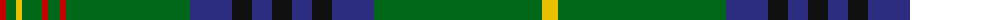

The parent of this is [King Edward VII Royal Family Tartan Tartan Number: 1559. Earliest known date: pre 1992 Reputed to be a tartan specifically woven for King Edward VII. In the possession of Miss K Roberts of Torquay. See Kennedy See products available Copyright © Blair Urquhart, Comrie, 2015](/tartans/r/12/g10/y6/g20/r6/g12/r6/g124/db42/k20/db20/k20/db20/k20/db42/g168/y/16/)

This was sourced from house-of-tartan.  It is a [17 stripes tartan](/stripes/stripes17/).

Original link http://www.house-of-tartan.scotland.net/house/TartanViewjs.asp?colr=Def&tnam=1559

## Thread count
R/12 G10 Y6 G20 R6 G12 R6 G124 DB42 K20 DB20 K20 DB20 K20 DB42 G168 Y/16

## Palette
Each colour and its ΔE from the base-6 reference it is a variant of.

| Colour | Shade | Base | ΔE (OKLab) |
|---|---|---|---|
| DB |  `#2C2C80` | B  | 0.05 |
| G |  `#006818` | G  | 0.02 |
| K |  `#101010` | K  | 0.17 |
| R |  `#C80000` | R  | 0.00 |
| Y |  `#E8C000` | Y  | 0.00 |

ID: /variants/r/12/g10/y6/g20/r6/g12/r6/g124/db42/k20/db20/k20/db20/k20/db42/g168/y/16-db2c2c80-g006818-k101010-rc80000-ye8c000/
